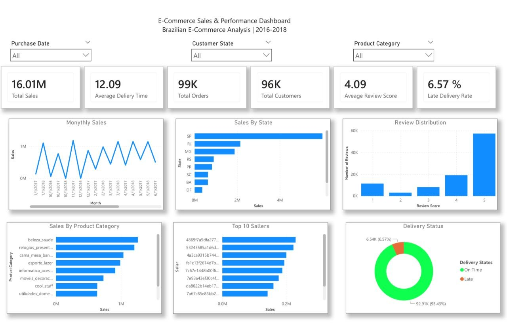

# Brazilian E-Commerce Sales & Performance Analysis

## Project Overview

This project analyzes the Brazilian E-Commerce Public Dataset by Olist to explore sales performance, customer behavior, product categories, seller performance, delivery performance, and customer reviews.

The project combines data analysis using Python and Pandas with an interactive Power BI dashboard to turn raw e-commerce data into clear business insights.

## Project Objectives

- Analyze sales trends over time
- Compare sales across customer states
- Identify the best-performing product categories
- Analyze seller performance
- Evaluate delivery performance
- Understand customer review distribution
- Build an interactive dashboard for business analysis

## Key Results

| KPI | Result |
|---|---:|
| Total Sales | 16.01M |
| Total Orders | 99,441 |
| Total Customers | 96,096 |
| Average Review Score | 4.09 |
| Average Delivery Time | 12.09 days |
| Late Delivery Rate | 6.57% |

## Analysis Process

The analysis included:

- Exploring and understanding the available datasets
- Preparing and combining related tables
- Analyzing sales performance
- Analyzing customer behavior
- Analyzing product categories
- Evaluating seller performance
- Analyzing delivery performance
- Analyzing customer reviews
- Creating an interactive Power BI dashboard

## Power BI Dashboard

The dashboard provides an interactive view of:

- Monthly Sales
- Sales by Customer State
- Sales by Product Category
- Top 10 Sellers
- Review Distribution
- Delivery Status

It also includes filters for:

- Purchase Date
- Customer State
- Product Category

## Tools & Technologies

- Python
- Pandas
- NumPy
- Jupyter Notebook
- Power BI
- DAX

## Dataset

Brazilian E-Commerce Public Dataset by Olist

The dataset contains Brazilian e-commerce data from 2016 to 2018 and includes information about orders, customers, products, sellers, payments, and reviews.

## Project Structure

`text
Brazilian-Ecommerce-Analysis/
│
├── README.md
│
├── notebook/
│   └── ecommerce_analysis.ipynb
│
├── powerbi/
│   └── ecommerce_dashboard.pbix
│
└── images/
    └── dashboard.jpg